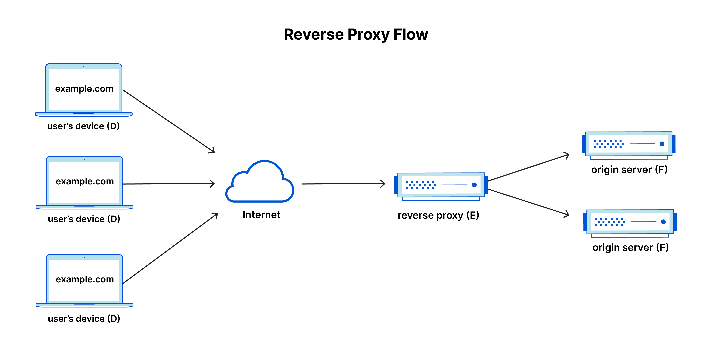

# Varnish Cache vs. Redis Cache

Varnish Cache and Redis Cache are two popular caching technologies commonly used in web applications. Both play a crucial role in improving website performance by reducing server load and accelerating content delivery.

## Varnish Cache

Varnish Cache is an open-source web application accelerator, also known as a caching HTTP `reverse proxy`. Its primary purpose is to speed up dynamic websites by caching content in memory, thus reducing the need to generate the same content repeatedly. Varnish Cache can cache various objects, including HTML, images, CSS, JavaScript, and even entire web pages. It shines in scenarios with high levels of dynamic content and traffic, effectively reducing the load on the web server.

## Redis Cache

Redis Cache, on the other hand, is an open-source, in-memory data structure store. It serves as a versatile tool capable of caching data in memory, functioning as a database, cache, and message broker. Redis can handle a wide range of data types, such as strings, hashes, lists, sets, and sorted sets. Its design prioritizes speed and efficient data storage, making it an excellent choice for applications demanding high read/write performance.

## Key Differences

The primary distinction between Varnish Cache and Redis Cache lies in the types of data they store:

> It's important to note that Varnish Cache is not a database, whereas Redis Cache can be used as one.

- **Primary Purpose**:

`Redis`: Redis is primarily an in-memory data store and cache. It's used for data storage, retrieval, and caching. It can store various data types like strings, hashes, lists, sets, and more. Redis is often used as a database, cache, or message broker.

`Varnish`: Varnish is a caching HTTP reverse proxy. Its primary purpose is to accelerate web applications by caching and serving web content, such as HTML, images, CSS, and JavaScript. Varnish focuses specifically on caching HTTP responses from web servers.

- **Data Types**:

`Redis`: Redis can store and manage a wide range of data types, making it versatile for various use cases beyond caching, such as real-time analytics and message queuing.

`Varnish`: Varnish is designed to cache HTTP responses, primarily web content. It doesn't deal with various data types like Redis.

- **In-Memory vs. On-Disk**:

`Redis`: Redis is an in-memory data store, which means it stores data in RAM for fast access. Data can be optionally persisted to disk for durability, but its primary strength is its in-memory performance.

`Varnish`: Varnish caches web content in memory as well, but it also provides an option to store cached objects on disk. It uses a combination of in-memory and on-disk caching.

- **Use Cases**:

`Redis`: Redis is suitable for applications that require high-speed data retrieval, caching, real-time analytics, pub-sub messaging, and task queuing. It's versatile and can be used as a primary data store in some scenarios.

`Varnish`: Varnish is ideal for web servers with high-traffic websites that want to offload the server by caching frequently accessed web content. It's commonly used for content delivery and load balancing.

- **Protocol**:

`Redis`: Redis uses its own protocol for communication and has clients available in various programming languages. It's often used in application code.

`Varnish`: Varnish uses HTTP as its protocol, which is well-suited for caching web content. It's typically deployed as a reverse proxy in front of web servers.

- **Configuration**:

`Redis`: Redis is configured primarily through a configuration file and command-line interface. It provides persistence options and advanced configuration settings for different use cases.

`Varnish`: Varnish is configured using its own domain-specific language called VCL (Varnish Configuration Language). VCL allows fine-grained control over caching rules and policies.

- **Use in Web Stack**:

`Redis`: Redis is typically used as a component within the application stack, often for caching, session management, or as a data store for specific use cases.

`Varnish`: Varnish is used as a standalone reverse proxy server, sitting in front of web servers and handling HTTP requests and responses.

In summary, Redis and Varnish are both valuable tools, but they serve distinct purposes. Redis is a versatile in-memory data store used for caching and various data storage tasks, while Varnish is a specialized HTTP reverse proxy designed specifically for web content caching and acceleration. The choice between them depends on your specific use case and requirements.

# What is a reverse proxy?

### Reverse Proxy

A reverse proxy is a server that sits between client devices and a web server. It receives client requests and forwards them to the appropriate backend server. Unlike a forward proxy, which is used to protect client anonymity, a reverse proxy is often used for load balancing, security, and caching purposes.

## Simple Example with The Coffee Shop Analogy

Imagine you're in a bustling coffee shop, and you want to order a cup of your favorite latte. Here's how the coffee shop operates as a reverse proxy:

- **You**: You walk up to the coffee shop's counter and place your order.

- **Cashier (Reverse Proxy)**: The friendly cashier takes your order, acts as the intermediary, and relays your request to the baristas in the back.

- **Baristas (Backend Servers)**: In the kitchen area, the skilled baristas prepare your latte with care. They may even collaborate with other baristas to create a masterpiece.

- **Cashier**: Once your latte is ready, the cashier calls out your name, hands you the delicious latte, and provides any necessary information, like the drink's temperature.

In this analogy:

- **You**: Represent the client device, such as a computer or smartphone, making a request.

- **Cashier (Reverse Proxy)**: Acts as the reverse proxy. It receives your order (request) and knows where to send it (to the baristas or backend servers).

- **Baristas (Backend Servers)**: Are the backend servers, where the actual work happens. They prepare the requested service (in this case, the latte).

So, in the world of web servers and clients:

- **Client Devices**: Make requests for web pages, resources, or services.

- **Reverse Proxy**: Acts as an intermediary, receiving and directing these requests to the appropriate backend servers.

- **Backend Servers**: Serve the web content or applications, just like the baristas prepare your latte.

# Why Reverse Proxies Are Important

Just like the coffee shop example, reverse proxies serve several crucial purposes in the web world:

- **Load Balancing**: They distribute client requests among multiple backend servers to ensure efficient use of resources and prevent overload.

- **Security**: Reverse proxies can provide an additional layer of security, filtering out malicious traffic and protecting the backend servers.

- **Caching**: They can cache frequently requested content, reducing the load on backend servers and speeding up responses.

- **SSL Termination**: Reverse proxies can handle the encryption and decryption of SSL/TLS connections, offloading this task from backend servers.

In essence, a reverse proxy is like the coffee shop cashier, streamlining and optimizing the flow of requests between clients and backend servers, ultimately ensuring a smoother and more efficient web service experience.

# What is a Forward Proxy?
A forward proxy (or simply `proxy`) is a server that sits between client devices and the internet. It acts on behalf of clients to request resources from servers. Forward proxies are often used to provide anonymity, content filtering, and caching for clients.

## Simple Example of a Forward Proxy
Imagine you want to access a website, let's say "example.com." Instead of connecting directly to the website, your device sends the request to a forward proxy server first. This proxy server acts on your behalf to access the website. It's like having a friend who goes to the store for you when you need something.

### Use curl with a forward proxy
**Scenario**: You're at work, and your company uses a forward proxy for web access. The IT department has set up this proxy for security and control. Here's how it works:

- Your Request: You want to visit a tech news website, "technews.com," during your lunch break.

- Proxy Request: Instead of your request going directly to "technews.com," it goes to the company's forward proxy server first.

- Proxy Evaluation: The forward proxy evaluates your request:

- It checks if "technews.com" is allowed according to the company's web access policy.
- It scans the website for any security threats like malware.

### Proxy Action:

If "technews.com" is approved and safe, the proxy fetches the webpage on your behalf.
It then sends the webpage to your device.
Your Response: You see the latest tech news on your screen, thanks to the proxy.

