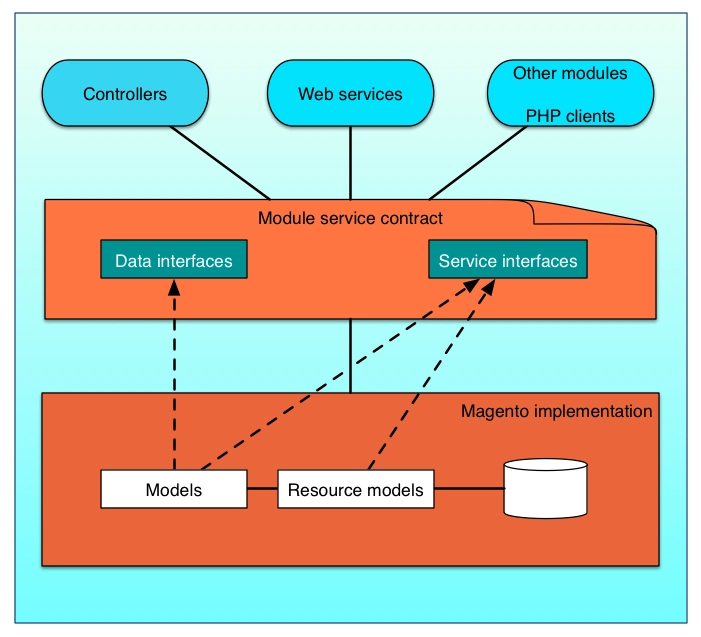

# Service Contracts

Adobe Commerce and Magento Open Source are modular systems that enable third-party developers to customize and overwrite core parts of the application framework. This flexibility, however, comes at a price. Business logic tends to leak across the layers of the system, which manifests as duplicated and inconsistent code.

Merchants might be reluctant to upgrade Adobe Commerce or Magento Open Source because customized extensions that they have purchased might not be compatible with new versions. Also, Adobe and third-party developers can find it difficult to track and report the dependencies that customized extensions have on other extensions.

To address these issues, Adobe Commerce and Magento Open Source introduced service contracts.

## What is a Service Contract?

A service contract is a set of PHP interfaces that are defined for a module. A service contract includes data interfaces, which preserve data integrity, and service interfaces, which hide business logic details from service requestors such as controllers, web services, and other modules.

If developers define data and service interfaces according to a set of design patterns, the result is a well-defined, durable API that other modules and third-party extensions can implement through models and resource models.

# Understanding Service Contracts in Magento

A **Service Contract** in Magento is like a well-structured agreement that modules follow. Think of it as a rulebook that ensures smooth communication and interaction between different parts of the system. Here's a simpler breakdown:

## What is a Service Contract?

Imagine you have a group project, and everyone needs to follow specific rules to work together efficiently. In Magento, a Service Contract is similar to these rules. It consists of two key parts:

- **Data Interfaces**: These are like data rules. They make sure that information is stored and handled consistently. It's like everyone agreeing on how data should be organized and accessed.

- **Service Interfaces**: Think of these as task instructions. They hide the complicated details of how things work, so you don't have to worry about them. It's like having a simple task list that anyone can follow.

## Why Are Service Contracts Important?

Now, you might be wondering, why bother with all this? Here's why it matters:

- **Consistency**: Service contracts ensure that everyone in the Magento system speaks the same language. This consistency prevents confusion and errors.

- **Compatibility**: When developers follow these rules, it's easier to connect different parts of the system. Third-party extensions can also work seamlessly without causing conflicts.

- **Simpler Development**: Service contracts make development more straightforward. Developers can create new features and extensions faster because they don't need to understand all the complex inner workings.

In a nutshell, Service Contracts are like the rules of the game in Magento. They keep everything running smoothly and help developers work together efficiently.
