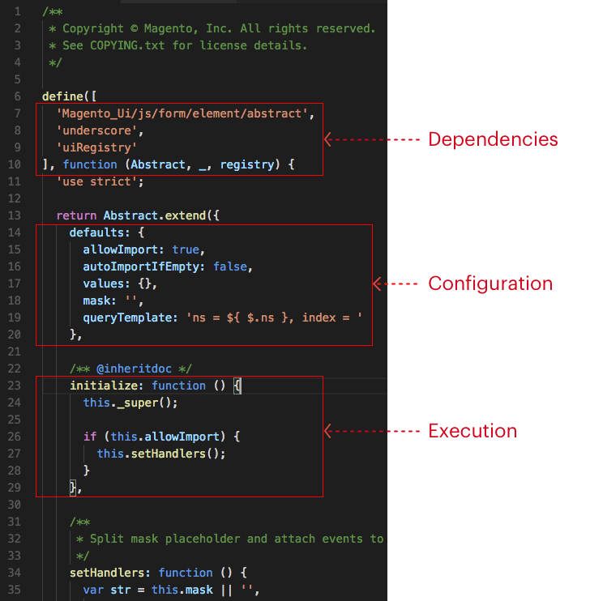

# Overview of UI Components in Magento 2

Magento UI components serve as essential building blocks for rendering various user interface elements in the Magento application. These components are designed to simplify and enhance the UI rendering process, offering flexibility and reusability. Below is an overview of UI components in Magento 2:

## Module Dependency

To utilize UI components in your custom module, ensure you have a dependency on the Magento_UI module in your module's composer.json file.

## Shared XSD File

Magento UI components share a common set of rules and constraints defined in the XSD file `ui_definition.xsd`. While extension developers cannot introduce new components through this XSD, they can customize existing ones.

## General Structure

Magento 2 UI components can be categorized into two main types: Basic and Secondary.

- **Basic Components:** These include Listing components and Form components. They are declared in page layout files.

- **Secondary Components:** All other UI components fall into this category and are declared in top-level component instances configuration files.

## Configuration Flexibility

UI components can be configured for both the Admin and storefront. It's important to note that styles for storefront components require manual configuration.

## When to Use UI Components?

In Magento, you have multiple options for implementing UI elements, including PHTML templates, jQuery widgets, and UI components. However, it's recommended to use UI components whenever possible, as they offer several advantages:

- Seamless Interaction: UI components work cohesively and communicate with each other through the uiRegistry service, making it easier to extend existing functionality or add new features.

- Asynchronous Initialization: UI components are asynchronous and can be initialized dynamically, enhancing the user experience.

## Understanding a UI Component

A UI component in Magento 2 comprises the following elements:

- **XML Declaration:** This XML file defines the component's configuration settings and internal structure. Components often form hierarchies, with child components nested within.

- **JavaScript Class:** Each UI component has an associated JavaScript class inherited from Magento JavaScript framework UI component base classes, such as UIElement, UIClass, or UICollection.

- **Related Template(s):** Templates are used to render the component's visual output, and multiple templates may be associated with a single component.

UI components provide a semantical approach to declaring and configuring the user interface, making it easier for developers to work with and customize the UI in Magento 2.

This illustration represents the implementation of a UI component's JavaScript class.

 
